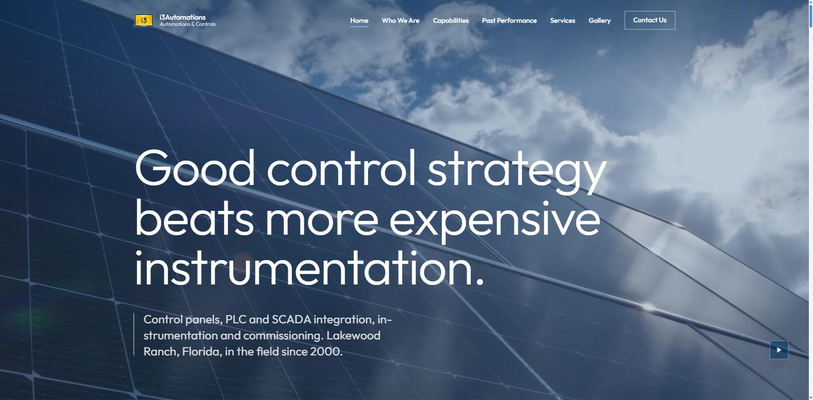
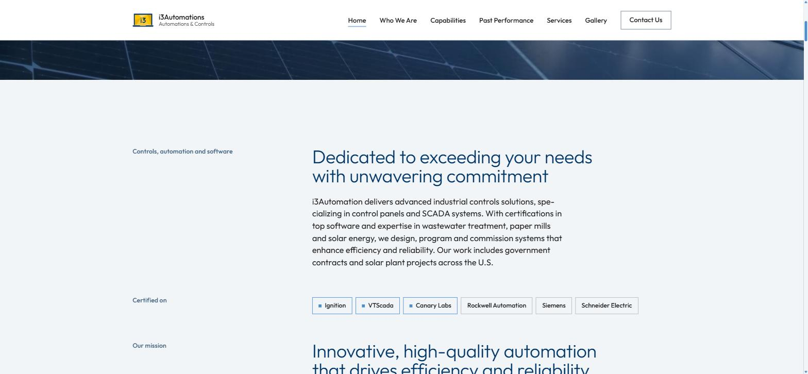
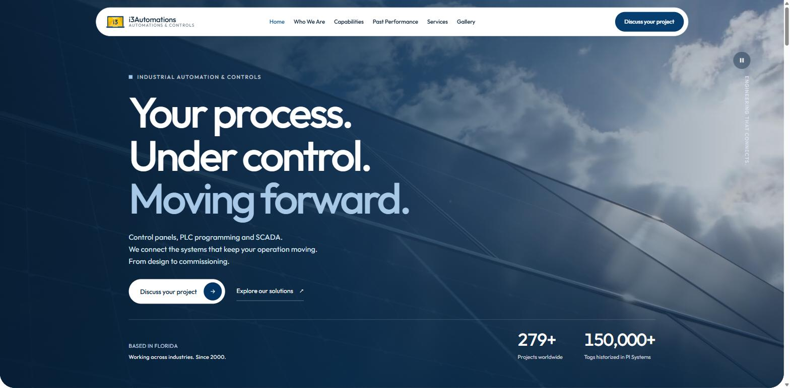
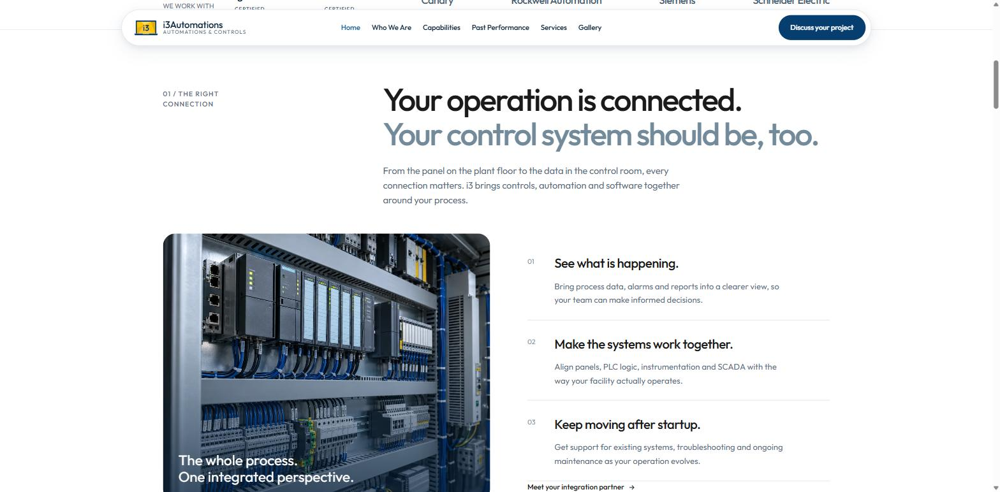

# i3 Automations — site (duas versões)

Este repositório guarda **duas versões completas do site da i3 Automations & Controls**.
Mesma empresa, mesmo conteúdo, mesma marca — duas direções de design diferentes,
mantidas lado a lado para comparação e escolha.

| | Versão | Pasta | Chamada principal |
|---|---|---|---|
| 1 | **Clássica** | [`I3AutomationSite/site/`](I3AutomationSite/site) | *Good control strategy beats more expensive instrumentation.* |
| 2 | **NueyStyle** | [`NueyStyle/`](NueyStyle) | *Your process. Under control. Moving forward.* |

Ambas são sites estáticos: HTML, CSS e JavaScript puro, sem framework, sem
dependências de runtime. As duas têm as mesmas páginas — Home, Who We Are,
Capabilities, Past Performance, Services, Gallery, Contact, além de política de
privacidade, termos e 404.

---

## Versão 1 — Clássica

`I3AutomationSite/site/`

Abertura com animação da marca (o logo se monta antes do conteúdo aparecer) e
hero em vídeo de painéis solares. O corpo do site é editorial e claro: rótulo à
esquerda, texto à direita, muito espaço em branco, azul institucional sobre
fundo quase branco. Sem cookies, sem analytics, sem scripts de terceiros.

**Estrutura:** `css/` com três arquivos (reset, tokens, style) e `js/` com os
módulos de animação (`braco`, `carta`, `gl`, `malha`, `mimico`, `mosaico`, `tela`).
A pasta `I3AutomationSite/` também carrega o material de apoio do projeto:
`referencia/` (imagens e marca), `specs/`, `melhorias/`, `ferramentas/` e as
anotações em Markdown.

---

## Versão 2 — NueyStyle

`NueyStyle/`

Direção mais comercial e contemporânea: barra de navegação flutuante em pílula,
hero em três linhas com a última em azul claro, botões de ação visíveis já na
primeira dobra e números de prova social (279+ projetos, 150.000+ tags
historiadas). O miolo é dividido em seções numeradas (`01 / THE RIGHT
CONNECTION`) com listas explicativas e foto grande ao lado.

**Estrutura:** `css/` em camadas (`tokens`, `base`, `pages`, `definitive`,
`cohesion`, `panel-reveal`, `interior`) e `js/` com os mesmos módulos da versão
clássica mais `definitive`, `experience`, `panel-reveal` e `gallery`.
Tem um passo de build opcional em `scripts/build.py`, que valida o HTML (ids
duplicados, links quebrados, imagens sem `alt`) e separa só os arquivos públicos
para deploy.

